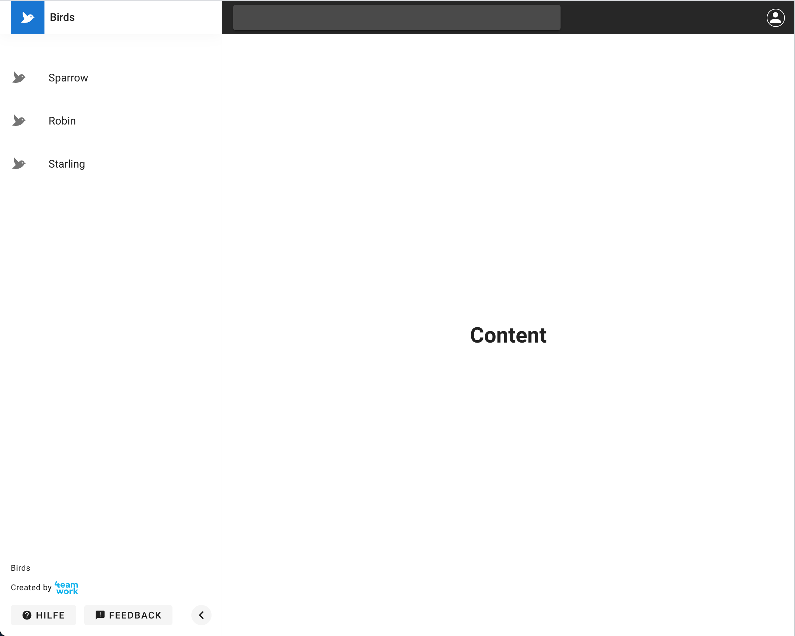

# ftw-app-layout

The `ftw-app-layout` component is used to provide the application layout for all 4teamwork applications.
The design is derived from the OneGov GEVER product. Various slots provide entrypoints for customizations.
The layout provides components such as the toolbar, usermenu, navigation, help- and feedback buttons.
The navigation is collapsible to safe space for mobile devices.



## Usage

``` vue
<template>
    <ftw-app-layout />
</template>
```

## Example

The following example defines navigation, toolbar, and the usermenu.
Also the appname and the fallback app in the top left corner are defined.

``` vue
<template>
  <ftw-app-layout show-help show-feedback :mini-variant.sync="miniVariant" app-name="My App">

    <template #fallback-app>
      <v-icon>mdi-bird</v-icon>
    </template>

    <template #navigation-main>
      <v-list nav>
        <v-list-item>
          <v-list-item-icon>
            <v-icon>mdi-bird</v-icon>
          </v-list-item-icon>
          <v-list-item-content>
            <v-list-item-title> Sparrow </v-list-item-title>
          </v-list-item-content>
        </v-list-item>
        <v-list-item>
          <v-list-item-icon>
            <v-icon>mdi-bird</v-icon>
          </v-list-item-icon>
          <v-list-item-content>
            <v-list-item-title> Robin </v-list-item-title>
          </v-list-item-content>
        </v-list-item>
        <v-list-item>
          <v-list-item-icon>
            <v-icon>mdi-bird</v-icon>
          </v-list-item-icon>
          <v-list-item-content>
            <v-list-item-title> Starling </v-list-item-title>
          </v-list-item-content>
        </v-list-item>
      </v-list>
    </template>

    <template #toolbar-main>
      <v-text-field hide-details solo-inverted dense />
    </template>

    <template #usermenu>
      <v-list dense>
        <v-list-item>
          <v-list-item-icon>
            <v-icon>mdi-account</v-icon>
          </v-list-item-icon>
          <v-list-item-content>
            <v-list-item-title> Hugo Boss </v-list-item-title>
          </v-list-item-content>
        </v-list-item>
        <v-list-item>
          <v-list-item-icon>
            <v-icon>mdi-flag</v-icon>
          </v-list-item-icon>
          <v-list-item-content>
            <v-list-item-title> English </v-list-item-title>
          </v-list-item-content>
        </v-list-item>
        <v-list-item>
          <v-list-item-icon>
            <v-icon>mdi-flag</v-icon>
          </v-list-item-icon>
          <v-list-item-content>
            <v-list-item-title> FranÇais </v-list-item-title>
          </v-list-item-content>
        </v-list-item>
        <v-list-item>
          <v-list-item-icon>
            <v-icon>mdi-flag</v-icon>
          </v-list-item-icon>
          <v-list-item-content>
            <v-list-item-title> Deutsch </v-list-item-title>
          </v-list-item-content>
        </v-list-item>
      </v-list>
    </template>

    <v-main>
      <Nuxt />
    </v-main>

  </ftw-app-layout>
</template>

<script>
export default {
  data() {
    return {
      miniVariant: false,
    }
  },
}
</script>
```

## Props

| Name           | Type    | Default | Description                                                                 |
|----------------|---------|---------|-----------------------------------------------------------------------------|
| apps           | Array   | []      | The apps listed in the AppSwitcher                                          |
| appName        | String  | ''      | The current apps name                                                       |
| customer       | String  | ''      | Will be listed in the toolbar next to the AppSwitcher                       |
| version        | String  | ''      | Will be listed next to the company attribution                              |
| showHelp       | Boolean | false   | Enables the Help Button                                                     |
| showFeedback   | Boolean | false   | Enables the feedback Button                                                 |
| miniVariant    | Boolean | false   | Enables the mini variant of the navigation                                  |
| permanent      | Boolean | true    | The drawer remains visible regardless of screen size                        |
| showNavigation | Boolean | false   | Reveals the Navigation. This has only effect if permanent is set to *false* |

## Events

| Name                   | Description                                                                        |
|------------------------|------------------------------------------------------------------------------------|
| help                   | Emits when the help button has been clicked                                        |
| feedback               | Emits when the feedback button has been clicked                                    |
| update:mini-variant    | Emits the current state of the mini variant when the mini variant has been changed |
| update:show-navigation | Emits the current state of the drawer value when show navigation has been changed  |

## Slots

| Name            | Description                                                                   |
|-----------------|-------------------------------------------------------------------------------|
| navigation-main | Slot to fill in the navigation items                                          |
| navigation-root | Slot to replace the whole navigation drawer                                   |
| toolbar-main    | Slot to fill in the left section of the toolbar                               |
| toolbar-root    | Slot to replace the whole toolbar                                             |
| toolbar-actions | Slot to fill in actions for the toolbar next to the user menu                 |
| app-icon        | Slot to define an app icon in top left corner                                 |
| usermenu        | Slot to fill in the usermenu                                                  |
| avatar          | Slot to replace the whole avatar                                              |
| avatar-image    | Slot to set image of the user avatar                                          |
| default         | Slot to define the content section. Usually needs a `v-main` to work properly |
