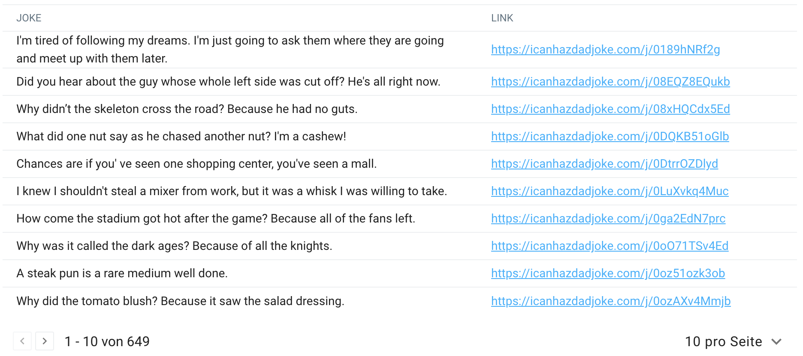

# ftw-serverside-collection

The ``ftw-serverside-collection`` component is used to display data fetched, filtered and sorted by the backend.

On small screens (``$vuetify.breakpoint.smAndDown``), the data is displayed as list items, otherwise as a customized data table.

::: warning
This component requires ``debounce-async``. Make sure to install it in order to use this component:

```bash
yarn add debounce-async
```
:::

Serverside Table:


Serverside Custom Table (alternative layout):


Serverside Listing:


## Usage

```vue
<template>
  <div>
    <ftw-serverside-collection :fetch="loadData" :headers="headers" />
  </div>
</template>

<script>
export default {
  data() {
    return {
      headers: [
        { text: 'One column', value: 'column_one' },
        { text: 'Other column', value: 'column_two' },
      ],
    }
  },
  methods: {
    loadData(filter) {
      return this.$http.$get('/api/endpoint/', { searchParams: filter })
    },
  },
}
</script>
```

## Example

The following example fetches data from an external API endpoint and displays it.
Note that this example does not apply any filter, see below for an example with a filter.

```vue
<template>
  <ServersideCollection
    :fetch="loadData"
    :headers="headers"
    :items-per-page-options="[10, 20, 30]"
    :items-per-page-default="10"
    count-property="total_jokes"
    page-size-param="limit"
  >
    <template #title="{ item: { joke } }">
      {{ joke }}
    </template>
    <template #item.id="{ item: { id } }">
      <a :href="`https://icanhazdadjoke.com/j/${id}`" target="_blank">
        {{ `https://icanhazdadjoke.com/j/${id}` }}
      </a>
    </template>
    <template #item="{ item }">
      <v-list-item>
        <v-list-item-content>
          <v-list-item-title>
            <strong>{{ item.joke }}</strong>
          </v-list-item-title>
          <v-list-item-subtitle>
            <a :href="`https://icanhazdadjoke.com/j/${item.id}`" target="_blank">
              {{ `https://icanhazdadjoke.com/j/${item.id}` }}
            </a>
          </v-list-item-subtitle>
        </v-list-item-content>
      </v-list-item>
    </template>
  </ServersideCollection>
</template>

<script>
export default {
  data() {
    return {
      headers: [{ text: 'Link', value: 'id', sortable: false }],
    }
  },
  methods: {
    loadData(filter) {
      return this.$http.$get('https://icanhazdadjoke.com/search', {
        headers: { Accept: 'application/json' },
        searchParams: filter,
      })
    },
  },
}
</script>
```

### Filtering and sorting

A filter can be defined and modified outside component. If it changes, the component fetches the data again. This works well with the component ``<ftw-text-filter-field>`` for example.
Similarly, the ordering parameter can be part of the filter. One may use the component ``<ftw-ordering-menu>`` for this.

```vue
<template>
  <div>
    <v-container fluid class="mb-2 d-flex">
      <ftw-text-filter-field v-model="userFilter.text" class="shrink" />
      <v-spacer />
      <ftw-ordering-menu v-model="userFilter.ordering" :items="userOrderingOptions" />
    </v-container>
    <ftw-serverside-collection :fetch="loadUsers" :headers="headers" :filter="userFilter">
      <template #item="{ item }">
        <v-list-item>
          <v-list-item-content>
            <v-list-item-title>
              <strong>{{ item.full_name }}</strong>
            </v-list-item-title>
            <v-list-item-subtitle>
              {{ item.username }}
            </v-list-item-subtitle>
          </v-list-item-content>
        </v-list-item>
      </template>
    </ftw-serverside-collection>
  </div>
</template>

<script>
import { fromQueryString } from '@4tw/ui/lib/util/query'

export default {
  data() {
    return {
      headers: [
        { text: 'Name', value: 'full_name', sortable: false },
        { text: 'Username', value: 'username', sortable: false },
      ],
      userFilter: fromQueryString(this.$route.query, ['text', 'ordering'], {
        text: '',
        ordering: 'last_name,first_name',
      }),
      userOrderingOptions: [
        { text: 'Name (A-Z)', value: 'last_name,first_name' },
        { text: 'Name (Z-A)', value: '-last_name,-first_name' },
      ],
    }
  },
  methods: {
    loadUsers(filter) {
      return this.$http.$get('/auth/users/', { searchParams: filter })
    },
  },
}
</script>
```

## Props

| Name                | Type     | Default              | Description                                                                                                                                                                                      |
|---------------------|----------|----------------------|--------------------------------------------------------------------------------------------------------------------------------------------------------------------------------------------------|
| fetch               | Function | ``(filter) => ({})`` | A function to fetch the data, e.g. from the backend.                                                                                                                                             |
| filter              | Object   | ``{}``               | The filter object passed to the fetch function, e.g. from the backend.                                                                                                                           |
| loading             | Boolean  | ``false``            | Externally set the loading state of the component.                                                                                                                                               |
| disablePagination   | Boolean  | ``false``            | Set this to ``true`` to hide the footer showing the pagination actions.                                                                                                                          |
| itemsPerPageOptions | Array    | ``[50, 100, 200]``   | Populates the dropdown to select number of items shown at once.                                                                                                                                  |
| itemsPerPageDefault | Number   | ``50``               | The default number of items shown at once when creating the component.                                                                                                                           |
| countProperty       | String   | ``'count'``          | The property of the data (as returned by the ``fetch`` function) containing the total number of elements available.<br>A dotted path notation can be used, e.g. ``meta.pagination.total_count``. |
| itemsProperty       | String   | ``'results'``        | The property of the data (as returned by the ``fetch`` function) containing the list of items.<br>A dotted path notation can be used.                                                            |
| pageSizeParam       | String   | ``'pageSize'``       | The query parameter expected by the backend to set the number of elements returned at once.                                                                                                      |
| pageParam           | String   | ``'page'``           | The query parameter expected by the backend used for the pagination control.                                                                                                                     |
| tableStyle          | String   | ``'table'``          | Change the table layout. Available values are ``['table', 'custom-table']``                                                                                                                      |

The component passes all props to its child components, e.g. it passes the `headers` property to the underlying ``<v-data-table>``.

## Events

| Name           | Description                                                                                                                         |
|----------------|-------------------------------------------------------------------------------------------------------------------------------------|
| update:loading | Emits the loading state of the component.                                                                                           |
| update:options | Emits the options state for the underlying v-data-table component. You can use this to change the sorting when a header is clicked. |

## Slots

| Name            | Description                                                                            |
|-----------------|----------------------------------------------------------------------------------------|
| ``item``        | Slot to set the layout used for the listing representation displayed on small screens. |
| ``title``       | Slot used to render a title at the top of each table row.                              |

Additionally, the component passes all slots to its child components, e.g. the slot ``item.<name>`` can be used to customize a specific column.

## Functions

To access the functions a ````ref```` needs to be defined on the table (i.e. ref="tableName") and the functions are
called like: this.$ref.tableName.function()

| Name            | Description                                                                            |
|-----------------|----------------------------------------------------------------------------------------|
| ``update``      | Updates the data in the table |
